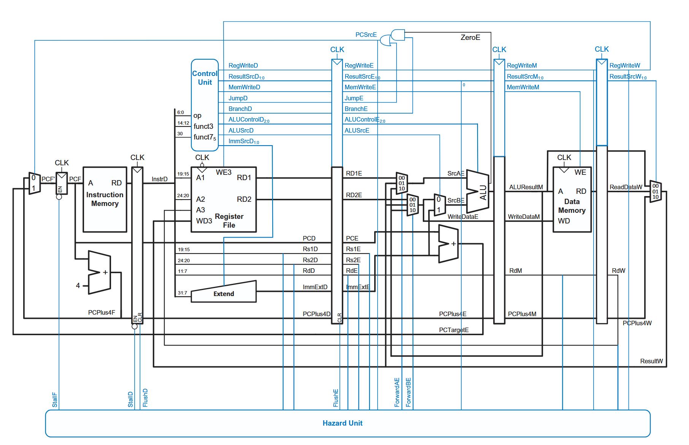

# Coffee Processing Unit - RV64I CPU



*Five-stage pipelined RV64I processor datapath used in this project. Courtesy of "Digital Design and Computer Architecture", by Sarah and David Harris.*

This repository contains an implementation of a single-core RV64I CPU, implemented fully in Verilog.
We have implemented both a **sequential** and a **pipelined** version of this processor - complete with hazard handling like forwarding and branch prediction.

Below is a list of supported instructions and how to run the CPU and generate outputs.

## Supported Instructions

For the most part, we've implemented a subset of the full I-type instruction set - focusing mostly on the CPU's computational and decision making instructions.

| Type   | Instructions                                                                         |
| ------ | ------------------------------------------------------------------------------------ |
| R-type | `add`, `sub`, `and`, `or`, `xor`, `sll`, `srl`, `sra`, `slt`, `sltu`                 |
| I-type | `addi`, `andi`, `ori`, `xori`, `slli`, `srli`, `srai`, `slti`, `sltiu`, `ld`, `jalr` |
| S-type | `sd`                                                                                 |
| B-type | `beq`                                                                                |
| J-type | `jal`                                                                                |

## Prerequisites

- [Icarus Verilog](http://iverilog.icarus.com/) (`iverilog`, `vvp`)
- gcc (for compiling the assembler)
- bash
- [GTKWave](http://gtkwave.sourceforge.net/) (optional)

## Usage

### Using `script.sh`
To streamline the process of running assembly code, a **script** has been provided. Before running the script, make sure to store your assembly code in the `testcases/` folder.
If you are running it for the first time, make it an executable and start it:

```bash
chmod +x script.sh
./script.sh
```

At the prompt, you can enter either:

- A bare filename like `simple.asm` (auto-resolved to `testcases/simple.asm`)
- A full/relative path like `testcases/haz_test_4.asm`

After that, the script will ask you to choose between the sequential or the pipelined processor - do so according to which processor needs to be run.

(A quick note before that, make a folder called `logs` so that the testbench can write register values and data memory values to their respective files.)

To run the script again after this, one can just use:

```bash
bash script.sh
```

Examples:

```bash
bash script.sh simple.asm
bash script.sh testcases/haz_test_4.asm
```

### Manually running without `script.sh`
Alternatively - you can just run the following commands. However we'd recommend you to use the script - it works!

```bash
# Assemble
gcc tools/assembler/assembler.c -o tools/assembler/asm
./tools/assembler/asm testcases/simple.asm -o testcases/simple.txt

# Sequential
iverilog src/arch/seq_tb.v
vvp ./a.out

# Pipelined
iverilog src/arch/pipe_tb.v
vvp ./a.out
```

## Output Files

- `logs/register.txt`: Register dump with cycle information
- `logs/data_memory.txt`: Data memory dump
- `pipe_tb.vcd` / `seq_tb.vcd`: Waveform files


## Repository Structure

```text
|
├── script.sh
├── src/
│   ├── arch/                  # CPU top modules and testbenches
│   │   ├── CPU_seq.v
│   │   ├── CPU_pipe.v
│   │   ├── seq_tb.v
│   │   └── pipe_tb.v
│   ├── core/                  # core modules
│   ├── stages/                # 5 pipeline stages
│   ├── hazards/               # hazard detection / forwarding
│   └── extensions/            # optional extensions
├── tools/
│   └── assembler/             # contains the assembler
├── testcases/                 # .asm programs and generated .txt machine code
├── logs/                      # simulation output dumps
└── docs/
    ├── references/            # References used in the making of the CPU
    └── report/                # LaTeX reports and figures

```
 

## References

- John L. Hennessy and David A. Patterson, *Computer Architecture: A Quantitative Approach*, Elsevier, 2011.
- Sarah Harris and David Harris, *Digital Design and Computer Architecture, RISC-V Edition*, Morgan Kaufmann, 2021.
- David A. Patterson and John L. Hennessy, *Computer Organization and Design*, Morgan Kaufmann, 2022.
- DownToTheWires, *RISC-V Intro and R-Type ALU Instructions*, 2025. URL: https://www.youtube.com/@DowntotheWires (Accessed: 2025).
